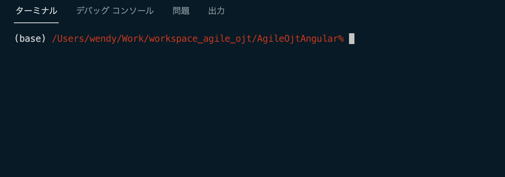
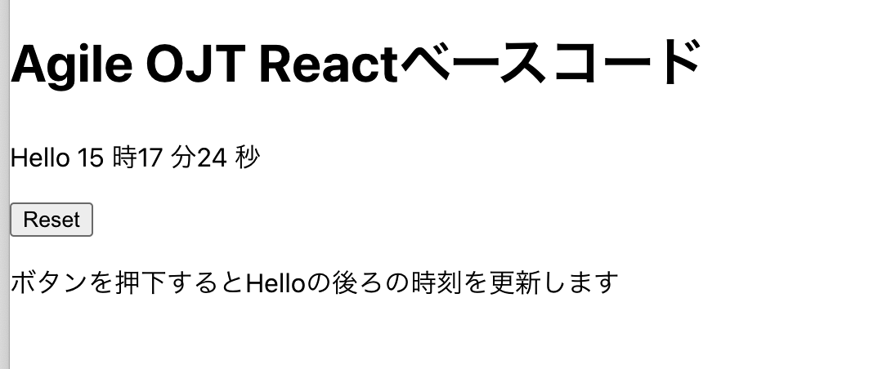

# React OJT Angular ベースコード

## 目次
- 概要
- コマンドラインでの実行方法
- VS Codeでの実行方法
- 稼働確認方法

## 概要
- 当ベースコードは、React スターターキットのコードをベースにしている

## コマンドラインでの実行方法
- 下記のコマンドを実行する
  ```
  > npm install
  .
  .
  .
  > npm start
  .
  .
  .
  Compiled successfully!
  
  You can now view myreact in the browser.
  
    Local:            http://localhost:3000
    On Your Network:  http://192.168.1.52:3000
  
  Note that the development build is not optimized.
  To create a production build, use npm run build.

  ```

## VS Codeでの実行方法
- VS Codeを起動して、下図のようにファイルメニューから「ワークスペースにフォルダーを追加...」を選択して、GitCloneしたフォルダーをワークスペースに追加する
  
- フォルダを選択して、右クリックで表示されるメニューから「統合ターミナルで開く」を選択する
  
- 下図のようにターミナルが開かれるので、既述の「コマンドラインでの実行方法」と同様に実行する
  


## 稼働確認方法
- ブラウザを開いて http://localhost:3000/ に接続する
- 下図のような画面が表示される
  
- 「Resetボタン」を押下すると、「Hello」の後ろの現時刻が更新される
- 自動再ロードに対応しているので、この状態でソースコードを修正すると、修正が即反映されるため、基本的に再起動の必要はない
